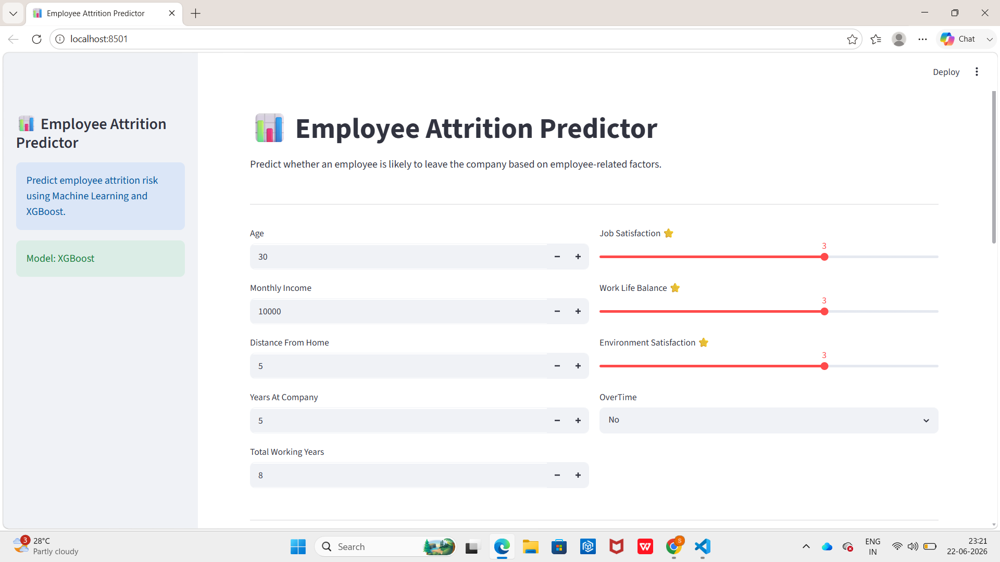
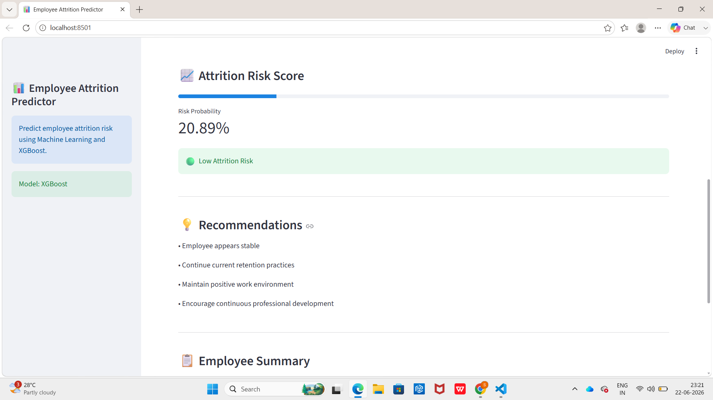
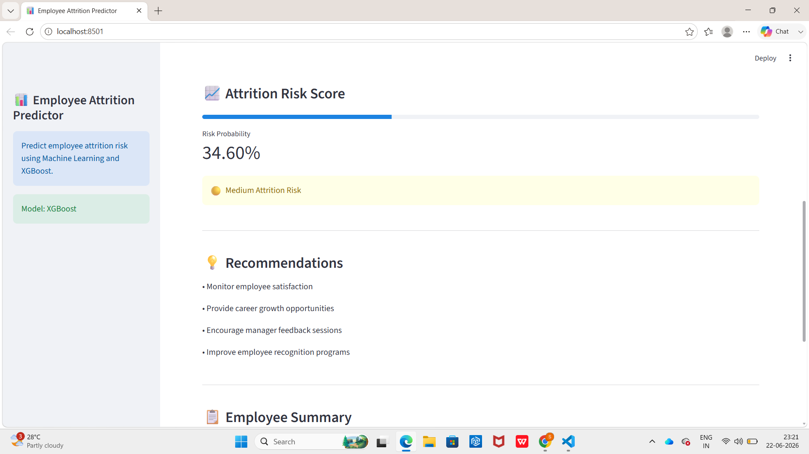
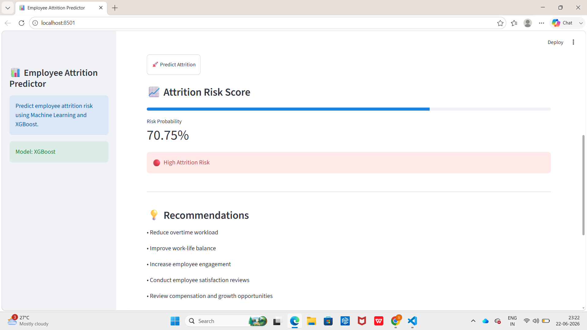

# Employee Attrition Prediction System

## Overview

An end-to-end Machine Learning project that predicts employee attrition risk using employee demographics, compensation, work-life balance, job satisfaction, and overtime information.

## Dataset

IBM HR Analytics Employee Attrition Dataset

## Features

* Exploratory Data Analysis (EDA)
* Feature Engineering
* SMOTE for Class Imbalance
* Logistic Regression
* Random Forest
* XGBoost
* SHAP Explainability
* Streamlit Web Application

## Tech Stack

* Python
* Pandas
* NumPy
* Scikit-Learn
* XGBoost
* SHAP
* Streamlit

## Model Performance

* Accuracy: ~82%
* ROC-AUC: ~80%
* Optimized for attrition risk identification

## Feature Importance

The model identified the following features as the strongest predictors of employee attrition.

 ## Business Insights

Analysis of employee attrition patterns revealed several key factors influencing employee turnover:

* Employees working overtime are significantly more likely to leave the organization.
* Lower job satisfaction scores are strongly associated with higher attrition risk.
* Employees with poor work-life balance demonstrate increased turnover tendencies.
* Shorter tenure employees are more likely to leave compared to long-term employees.
* Monthly income and career growth opportunities influence employee retention.
* Environmental satisfaction plays a critical role in reducing attrition risk.

These insights can help HR teams design targeted retention strategies and improve workforce stability.

## Deployment

Interactive Streamlit application for real-time employee attrition prediction.

## Screenshots

### Home Page

### Low Attrition Prediction

### Medium Attrition Risk

### High Attrition Prediction

## Future Improvements

* Database Integration
* User Authentication
* Advanced Explainability Dashboard
* Prediction History Tracking
